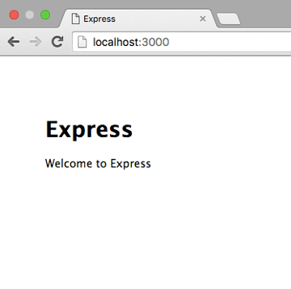

# ExpressStudy
* Node.jsのMVCフレームワーク


## インストールからHello Worldまで

1. express-generator(expressの雛形を生成するもの)をインストールする
```shell
$ npm install -g express-generator
```


2. アプリ名を指定してexpressアプリケーションを生成する。(ディレクトリが作成され、ディレクトリ内に必要なファイルが作成される)
```
$ express "アプリ名"
```

3. 2.で作成したディレクトリに移動
```
$ cd "アプリ名"
```

4. アプリ内に依存関係をインストール
```
$ npm install
```

5. localhostが起動する
```
$ npm start
```

6. [localhost:3000](http://localhost:3000)にアクセスする

7. ページが表示される


