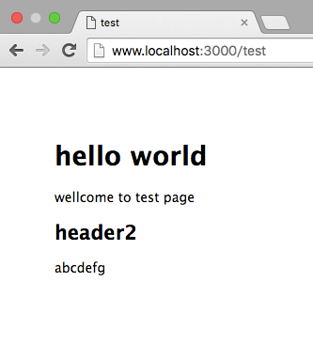

# ExpressStudy
* Node.jsのMVCフレームワーク


## インストールからHello Worldまで

(1) express-generator(expressの雛形を生成するもの)をインストールする
```shell
$ npm install -g express-generator
```

(2) アプリ名を指定してexpressアプリケーションを生成する。(ディレクトリが作成され、ディレクトリ内に必要なファイルが作成される)
```
$ express "アプリ名"
```

(3) 2.で作成したディレクトリに移動
```
$ cd "アプリ名"
```

(4) アプリ内に依存関係をインストール
```
$ npm install
```

(5) localhostが起動する
```
$ npm start
```

(6) [localhost:3000](http://localhost:3000)にアクセスする

(7) ページが表示される


## ディレクトリ構造
```
.
├── app.js
├── bin
│   └── www
├── node_modules        ...node.jsのモジュール群が入っている
│   ├── accepts
│   :
│   :
│   └─
├── package.json
├── public
│   ├── images
│   ├── javascripts
│   └── stylesheets
│       └── style.css
├── routes              ...MVCのCの部分を扱う
│   ├── index.js
│   └── users.js
└── views               ...MVCのVの部分を扱う
    ├── error.jade
    ├── index.jade
    └── layout.jade

211 directories, 917 files

```


## Hello Worldのファイル
### app.js
```js
//各Nodeモジュールのインスタンス化
var express = require('express');//nodejs用のwebアプリ作成フレームワーク
var path = require('path');//ファイルパスを扱うユーティリティ
var favicon = require('serve-favicon');//ファビコンを表示する
var logger = require('morgan');// HTTPリクエストのログを吐き出す
var cookieParser = require('cookie-parser');//クッキーをパースする
var bodyParser = require('body-parser');//リクエストパラメータのパーサーを設定する

//routingモジュールの読み込み
var routes = require('./routes/index');
var users = require('./routes/users');

var app = express();//アプリケーションのインスタンスを生成

// view engine setup
app.set('views', path.join(__dirname, 'views'));
app.set('view engine', 'jade');

// uncomment after placing your favicon in /public
//app.use(favicon(path.join(__dirname, 'public', 'favicon.ico')));
app.use(logger('dev'));
app.use(bodyParser.json());
app.use(bodyParser.urlencoded({ extended: false }));
app.use(cookieParser());
app.use(express.static(path.join(__dirname, 'public')));

app.use('/', routes);
app.use('/users', users);

// catch 404 and forward to error handler
app.use(function(req, res, next) {
  var err = new Error('Not Found');
  err.status = 404;
  next(err);
});

// error handlers

// development error handler
// will print stacktrace
if (app.get('env') === 'development') {
  app.use(function(err, req, res, next) {
    res.status(err.status || 500);
    res.render('error', {
      message: err.message,
      error: err
    });
  });
}

// production error handler
// no stacktraces leaked to user
app.use(function(err, req, res, next) {
  res.status(err.status || 500);
  res.render('error', {
    message: err.message,
    error: {}
  });
});

module.exports = app;
```


こちらに詳しく書いてありました->[node初心者がexpress-generatorで吐き出されたapp.jsを読んでみる](http://qiita.com/mito_log/items/735f7079f99ec78ea7e6)


### router/index.js
```js
var express = require('express');
var router = express.Router();

/* GET home page. */
router.get('/', function(req, res, next) {
  res.render('index', { title: 'Express' });
});

module.exports = router;
```

## /testにアクセスする
* [localhost:3000/test](http://localhost:3000/test)にアクセスした時にテストページを表示するようにする。

* [書き換える/追加する]ファイル
  * ./routes/index.js
  * ./views/test.jade
  * ./app.js

### ./routes/index.js
以下のコードを追加する
```js
router.get("/test",function(req,res,next){
  res.render('test',{title:'test'});
});
```
* /testというリクエストが来たら"test.jade"にrenderを送る.
* その際にtitle属性?に"test"という文字列を代入?して送る

### ./vies/test.jade
以下ファイルを作成する
```jade
extends layout
block content
	title #{title}
	h1 hello world
	p wellcome to test page

	h2 header2
	p abcdefg
```
* \#{変数名}を使うことによって、renderで送られてきた変数を受け取る事ができる。

### 出力例



## 参考資料
http://www.atmarkit.co.jp/ait/articles/1503/04/news047_3.html
